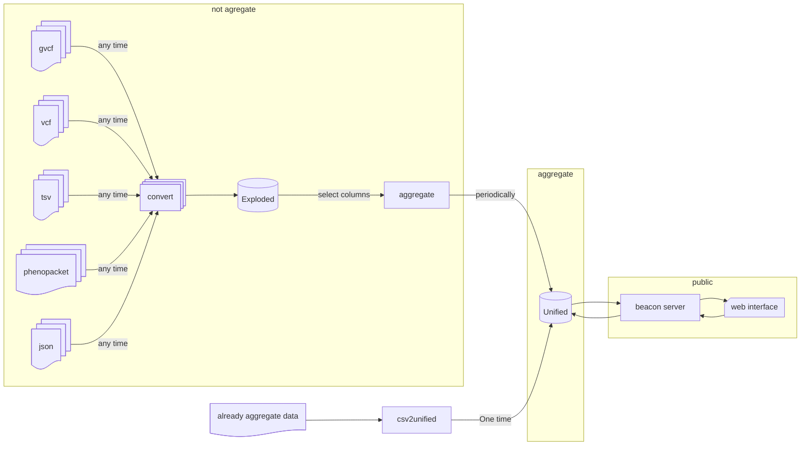
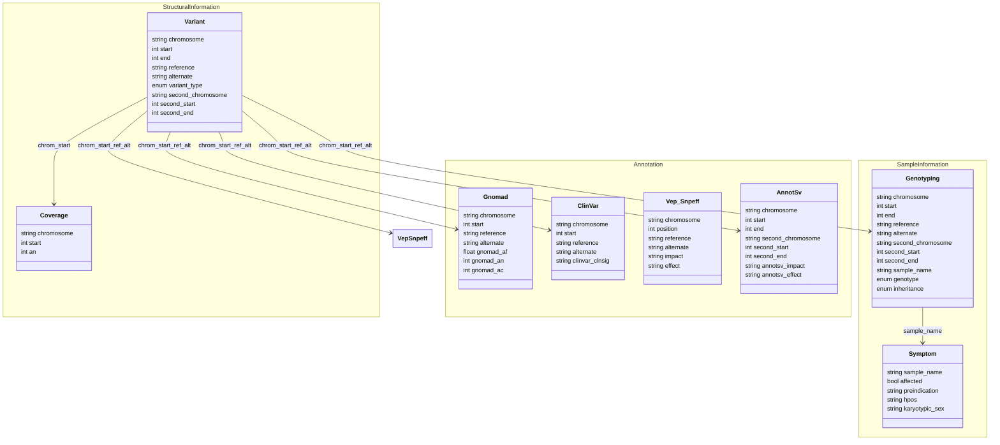

# Variant Knowledge Base

VKB are split in two base:
- exploded: Many table for variant, annotation, sample information and disease information
- unified: One unique iceberg table with many repetition partitioned

## Pipeline

## Exploded schema

[Details](doc/exploded_schema.md)

## Unified schema

| type   | field                | mandatory | origin                 |
|--------|----------------------|-----------|------------------------|
| string | chromosome           | Yes       | `Variant`              |
| int    | start                | Yes       | `Variant`              |
| int    | end                  | Yes       | `Variant`              |
| string | reference            | Yes       | `Variant`              |
| string | alternate            | Yes       | `Variant`              |
| enum   | variant_type         | Yes       | `Variant`              |
| string | second_chromosome    | No        | `Variant`              |
| int    | second_start         | No        | `Variant`              |
| int    | second_end           | No        | `Variant`              |
| int    | an                   | Yes       | `Coverage`             |
| float  | gnomad_af            | No        | `Gnomad`               |
| int    | gnomad_an            | No        | `Gnomad`               |
| int    | gnomad_ac            | No        | `Gnomad`               |
| enum   | clinvar_clnsig       | Yes       | `ClinVar`              |
| enum   | impact               | Yes       | `VepSnpeff`/`AnnotSv`  |
| enum   | effect               | Yes       | `VepSnpeff`/`AnnotSv`  |
| string | gene_symbol          | Yes       | `VepSnpeff`/`AnnotSv`  |
| string | transcript_id        | Yes       | `VepSnpeff`/`AnnotSv`  |
| bool   | affected             | No        | `Symptom`              |
| string | preindication        | Yes       | `Symptom`              |
| string | hpos                 | Yes       | `Symptom`              |
| string | karyotypic_sex       | Yes       | `Symptom`              |
| string | sample_name          | No        | `Genotyping`           |
| enum   | genotype             | Yes       | `Genotyping`           |
| enum   | inheritance          | Yes       | `Genotyping`           |
| int    | ac                   | No        | Compute                |
| float  | af                   | No        | Compute                |

[Details](doc/unified_schema.md)

## Features

- `bin`: activate command line interface
- `request`: activate request functionality
- `rest_server`: activate subcommand beacon to launch a server (activate feature `request`)
- `default`: `bin`

## Subcommand

CLI are available only if features `bin` are set.

### convert

This subcommand load data from a classic bioinformatic file and save information in exploded database.

#### Load

- gvcf: information `Variant`, `Coverage` and `Genotyping`
- vcf: information `Variant`, any `Annotation` table
- tsv: any type of information
- phenopacket: information `Symptom`
- json: any type of information

#### Save

- variant: save loaded information in `Variant`
- coverage: save loaded information in `Coverage`
- annotation: save loaded information in table `Annotation`
- symptom: save loaded information in `Symptom`
- genotyping: save loaded information in `Genotyping`

### aggregate

This subcommand take information from exploded database and aggregate it in unified database.

User should select which table integrate a parameter indicate which column delete.
Aggregation method are define by subcommand:
- genotyping

### csv2unified

This subcommand take information from a file and build a unified table with this data.

### beacon

This subcommand start a http Beacon REST server, features `rest_server` are required.
