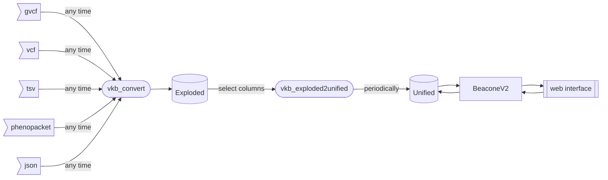
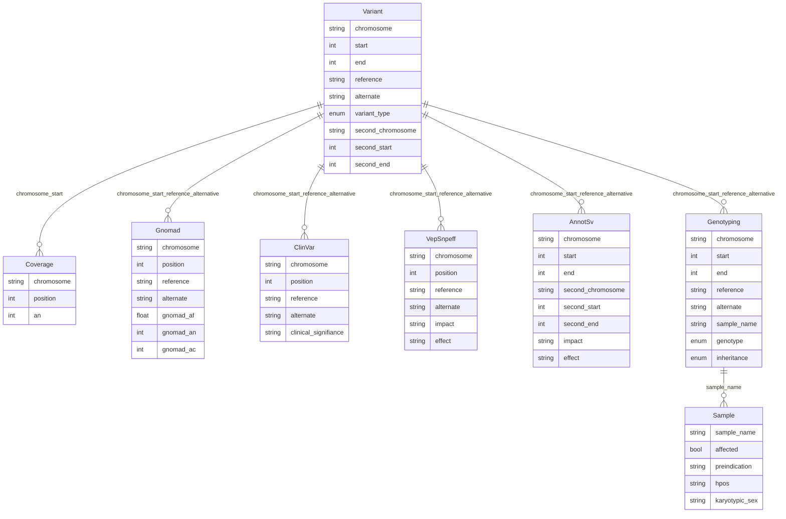

# Variant Knowledge Base

VKB are split in two base:
- exploded: Many table for variant, annotation, sample information and disease information
- unified: One unique iceberg table with many repetition partitioned

## Pipeline

## Exploded schema

[Details](doc/exploded_schema.md)

## Unified schema

| type   | field                | mandatory | origin       |
|--------|----------------------|-----------|--------------|
| string | chromosome           | Yes       | `Variant`    |
| int    | start                | Yes       | `Variant`    |
| int    | end                  | Yes       | `Variant`    |
| string | reference            | Yes       | `Variant`    |
| string | alternate            | Yes       | `Variant`    |
| string | variant_type         | Yes       | `Variant`    |
| string | second_chromosome    | No        | `Variant`    |
| int    | second_start         | No        | `Variant`    |
| int    | second_end           | No        | `Variant`    |
| int    | an                   | Yes       | `Coverage`   |
| float  | gnomad_af            | No        | `Gnomad`     |
| string | clinical_signifiance | Yes       | `ClinVar`    |
| string | impact               | Yes       | `VepSnpeff`  |
| string | effect               | Yes       | `VepSnpeff`  |
| string | vepsnpeff_impact     | No        | `AnnotSv`    |
| string | vepsnpeff_effect     | No        | `AnnotSv`    |
| bool   | affected             | No        | `Sample`     |
| string | preindication        | Yes       | `Sample`     |
| string | hpos                 | Yes       | `Sample`     |
| string | karyotypic_sex       | Yes       | `Sample`     |
| string | sample_name          | Yes       | `Genotyping` |
| string | inheritance          | Yes       | `Genotyping` |

[Details](doc/unified_schema.md)

## vkb_convert

## vkb_exploded2unified
