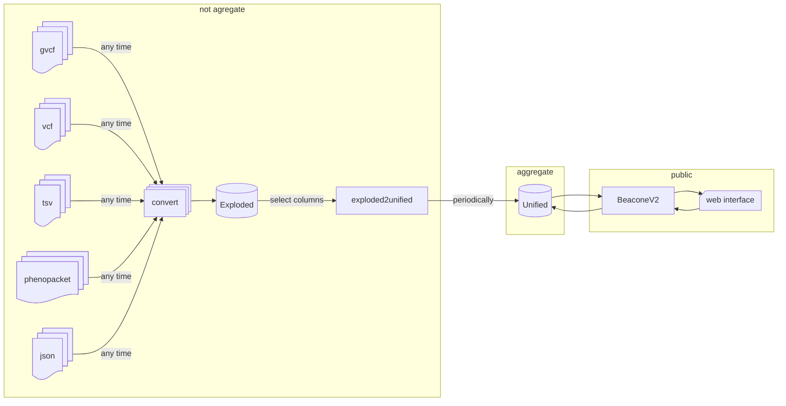
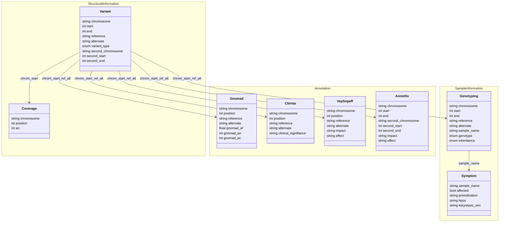

# Variant Knowledge Base

VKB are split in two base:
- exploded: Many table for variant, annotation, sample information and disease information
- unified: One unique iceberg table with many repetition partitioned

## Pipeline

## Exploded schema

[Details](doc/exploded_schema.md)

## Unified schema

| type   | field                | mandatory | origin       |
|--------|----------------------|-----------|--------------|
| string | chromosome           | Yes       | `Variant`    |
| int    | start                | Yes       | `Variant`    |
| int    | end                  | Yes       | `Variant`    |
| string | reference            | Yes       | `Variant`    |
| string | alternate            | Yes       | `Variant`    |
| string | variant_type         | Yes       | `Variant`    |
| string | second_chromosome    | No        | `Variant`    |
| int    | second_start         | No        | `Variant`    |
| int    | second_end           | No        | `Variant`    |
| int    | an                   | Yes       | `Coverage`   |
| float  | gnomad_af            | No        | `Gnomad`     |
| string | clinical_signifiance | Yes       | `ClinVar`    |
| string | impact               | Yes       | `VepSnpeff`  |
| string | effect               | Yes       | `VepSnpeff`  |
| string | annotsv_impact       | No        | `AnnotSv`    |
| string | annotsv_effect       | No        | `AnnotSv`    |
| bool   | affected             | No        | `Symptom`    |
| string | preindication        | Yes       | `Symptom`    |
| string | hpos                 | Yes       | `Symptom`    |
| string | karyotypic_sex       | Yes       | `Symptom`    |
| string | sample_name          | Yes       | `Genotyping` |
| string | inheritance          | Yes       | `Genotyping` |

[Details](doc/unified_schema.md)

## Subcommand
### convert

This command are split in two subcommand, one to load data and another to save data.

#### Load

- gvcf: information `Variant`, `Coverage` and `Genotyping`
- vcf: information `Variant`, any `Annotation` table
- tsv: any type of information
- phenopacket: information `Symptom`
- json: any type of information

#### Save

- variant: save loaded information in `Variant`
- coverage: save loaded information in `Coverage`
- annotation: save loaded information in `Annotation` user need to indicate which table are targeted
- symptom: save loaded information in `Symptom`
- genotyping: save loaded information in `Genotyping`

### exploded2unified

This command take information from exploded database and aggregate it in unified database.

User should select which table integrate a parameter indicate which column delete.
Aggregation method are define by subcommand:
- genotyping
